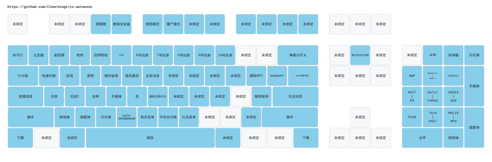
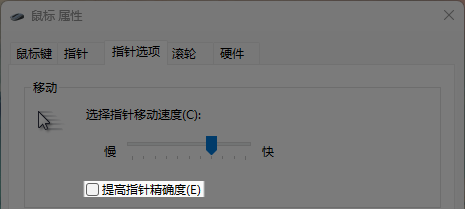

# autoexec.cfg

这是本人 Counter-Strike 系列游戏的硬件及 `autoexec.cfg` 配置参照.

> 参照信息:

- [新闻中心](https://store.steampowered.com/news/app/730)
- [Valve 开发者社区](https://developer.valvesoftware.com/wiki)
- [CS2指令合集(游戏内基本设置、实用指令)](https://www.bilibili.com/opus/919897577226240086) by ResoundXXXL on Bilibili

## 食用指南

打开终端并复制命令:

```zsh
git clone https://github.com/ilearnings/cs-autoexec.git
```

将 `cs-autoexec\` 文件夹中的文件复制到 `\<你的Steam文件夹>\steamapps\common\Counter-Strike Global Offensive\game\csgo\cfg\` 目录下即可

## 启动项(Steam)

```cfg
-perfectworld -high -nojoy -novid -refresh 170 -threads 16 -tickrate 128 +rate 786432
```

#### 启动项(PWA)

```cfg
-perfectworld -high -nojoy -novid -refresh 170 -threads 16 -tickrate 128 +rate 786432 +exec autoexec.cfg
```

| 参数 | 说明 |
| :--- | :--- |
| `-perfectworld` | *开启国服 (二选一) |
| `-worldwide` | *开启国际服 (二选一) |
| `-high` | 高优先级 |
| `-nojoy` | 关闭遥杆 |
| `-novid` | 关闭开场动画 |
| `-refresh 170` | 强制刷新率 `<屏幕刷新率>` |
| `-threads 16` | 多线程优化 `<CPU线程数>` |
| `-tickrate 128` | 游戏采样速率 `<官匹64,非官匹128>` |
| `+exec FILE.cfg` | 执行 `<FILE.cfg>` 文件 |

## 按键绑定

[](https://raw.githubusercontent.com/ilearnings/cs-autoexec/main/images/key-bindings.svg)

## 鼠标



| 配置项 | 值 |
| :--- | :--- |
| Windows | 7 |
| DPI | 1000 |
| Hz | 1000 |

## 显卡

| 配置项 | 值 |
| :--- | :--- |
| 设置G-Sync | 以窗口和全屏模式启动 |

## 显示

| 配置项 | 值 |
| :--- | :--- |
| 增强角色对比度 | 启用 |
| V-Sync | 已启用 |
| NVIDIA G-Sync | 已启用 + 加速 |
| NVIDIA Reflex 低延迟 | 已启用 |
| 当前视频值预设 | 自定义 |
| 多重采样抗锯齿模式 | 2X MSAA |
| 全局阴影效果 | 低 |
| 动态阴影 | 全部 |
| 模型/贴图细节 | 低 |
| 贴图过滤模式 | 双线性 |
| 影细节 | 低 |
| 粒子细节 | 低 |
| 环境遮蔽光 | 高 |
| 高动态范围 | 品质 |
| Fidelity FX超级分辨率 | 已禁用(最高品质) |

## 已取消配置

```cfg
// 大跳
alias "+bjump" "+jump; +duck"
alias "-bjump" "-jump; -duck"
bind "SPACE" "+bjump"

// 向前一步跳投
alias "+forwardjumpaction" "+forward; +jump"
alias "-forwardjumpaction" "-jump; -forward"
alias "+throwaction" "-attack; -attack2"
bind "f" "+forwardjumpaction; +throwaction"

// 原地跳投
alias "+jumpaction" "+jump"
alias "+throwaction" "-attack; -attack2"
alias "-jumpaction" "-jump"
bind "MOUSE4" "+jumpaction; +throwaction"
```

---
---
---

## 开发指南

本地开发环境

### 前置要求

- Linux / Windows
- Git
- uv

### 克隆仓库

```zsh
git clone https://github.com/ilearnings/cs-autoexec.git
cd cs-autoexec
```

### 建立本地环境

```zsh
uv sync --project keymap
```

这一步会:

- 在 `keymap/` 下创建虚拟环境
- 根据 `keymap/pyproject.toml` 和 `keymap/uv.lock` 安装依赖
- 依赖包括 `pyyaml` 和 `types-pyyaml`

`uv sync --project keymap` 只在首次或依赖变更后需要执行

### 本地生成

手动跑三步,生成中间文件、图片和时间戳:

```zsh
uv run --project keymap python keymap/parse.py

uv tool run --from keymap-drawer keymap \
  -c keymap/config.yml \
  draw keymap/keymap.yml \
  -j keymap/layout.json \
  -o images/key-bindings.svg

uv run --project keymap python keymap/stamp.py
```

生成结果:

- `keymap/keymap.yml`: 从 `autoexec.cfg` 提取的标签映射
- `images/key-bindings.svg`: 渲染出的按键图,并写入生成时间戳

`keymap/stamp.py` 只使用标准库,可重复执行,每次都会覆盖旧时间戳

### 本地预览

浏览器打开 `images/key-bindings.svg` 查看效果

### 修改内容

主要修改 `autoexec.cfg` 规则:

- 只处理 `bind` 开头的行
- 用 `^...^` 标记按键标签,例如:

```cfg
bind "a" "+forward" // ^左移^
```

- 没有 `^...^` 的键会显示键名 (灰色)

### 标签换行规则

`parse.py` 按以下优先级依次尝试拆分标签, 谁先命中谁生效:

| 顺序 | 规则 | 示例 | 结果 |
| :--- | :--- | :--- | :--- |
| 1 | 标签已含 `\n` | `A\nB` | 原样返回 |
| 2 | 含 `/` | `AK47 / M4系列` | `AK47` / `M4系列` 两行 |
| 3 | 含中文 `-` | `滚轮-跳` | `滚轮` / `跳` 两行 |
| 4 | `BOT` / `R Shift` 等前缀 | `BOT原地添加` | `BOT` / `原地添加` 两行 |
| 5 | 纯中文 (含数字) | `中性名切换` | `中性名` / `切换` 两行 |
| 6 | 长度 > 6 | `ABCDEFG` | `ABCD` / `EFG` 两行 |
| 7 | 以上都不命中 | `AK47` | 原样返回 |

#### 纯中文拆分细则

对纯中文 (含数字) 标签, 按字数拆:

- 3 字及以下: 不拆
- 偶数长度: 上下均匀 (4 字 → 2/2, 6 字 → 3/3, 8 字 → 4/4)
- 奇数长度: 上排最多 3 字 (5 字 → 3/2, 7 字 → 3/4)

#### 超长标签警告

纯中文 (含数字) 标签超过 **8 字** 时, `parse.py` 会打印警告:

- 本地运行: 终端显示 `警告: ...`
- GitHub Actions: 显示在运行页顶部的 **Annotations** 区域

建议拆分或缩短, 避免渲染时被 keymap-drawer 二次折行

### 提交并推送

```zsh
git add .
git commit -m "update bindings"
git push
```

推送后 GitHub Actions 会自动:

1. 运行 `keymap/parse.py` 生成 `keymap/keymap.yml`
2. 运行 keymap-drawer 生成 SVG
3. 运行 `keymap/stamp.py` 为 SVG 写入时间戳
4. 提交回仓库

不需要在本地再跑生成命令

### 触发条件

Actions 只在以下情况触发:

- 推送到 `main` 分支
- 改动包含以下任一文件:
  - `autoexec.cfg`

改 `README.md`, `parse.py`, `stamp.py` 等其他文件不会触发

### 手动触发一次

如果想让 Actions 立刻跑一次, 在 GitHub 网页上编辑 `autoexec.cfg`, 随便改一个 `^...^` 标签并 commit 即可

### 目录结构

```text
cs-autoexec/
├── .github/
│   ├── dependabot.yml                 # Dependabot 配置
│   └── workflows/
│       ├── dependabot-auto-merge.yml  # Dependabot PR 自动合并
│       └── update-key-bindings.yml    # 键位图生成 Actions
├── autoexec.cfg                       # 源配置
├── images/key-bindings.svg            # 自动生成的图片
├── keymap/                            # 配置文件夹
│   ├── config.yml                     # keymap-drawer 渲染配置
│   ├── keymap.yml                     # 自动生成的中间文件
│   ├── layout.json                    # 键盘物理布局
│   ├── parse.py                       # 解析脚本
│   ├── pyproject.toml                 # 项目依赖声明
│   ├── stamp.py                       # 为 SVG 写入时间戳
│   └── uv.lock                        # 依赖锁定文件
└── README.md                          # 说明文档
```

### 文件职责

| 文件 | 说明 | 手动维护 |
| --- | --- | --- |
| `autoexec.cfg` | 源配置 | ✅ |
| `images/key-bindings.svg` | 最终图片 | 自动 |
| `keymap/config.yml` | 渲染配置 | ✅ |
| `keymap/keymap.yml` | 中间产物 | 自动 |
| `keymap/layout.json` | 键盘布局 | ✅ |
| `keymap/parse.py` | 解析脚本 | ✅ |
| `keymap/pyproject.toml` | 依赖声明 | ✅ |
| `keymap/stamp.py` | 为 SVG 写入时间戳 | ✅ |
| `keymap/uv.lock` | 依赖锁定 | 自动 |
