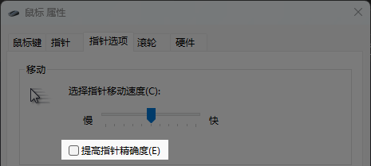

# autoexec.cfg

这是我本人Counter-Strike系列游戏的硬件及 ```autoexec.cfg``` 配置参照

> 参考信息:

- [新闻中心](https://store.steampowered.com/news/app/730)
- [Valve开发者社区](https://developer.valvesoftware.com/wiki)
- [参考B站UP : Resound919 的CS2指令合集(游戏内基本设置、实用指令)](https://www.bilibili.com/opus/919897577226240086)

## 食用指南

1. 打开终端并复制命令 ```git clone https://github.com/ilearnings/cs-autoexec.git``` 
2. 将 ```cs-autoexec``` 文件夹中的 ```autoexec.cfg``` 文件复制到 ```\<你的Steam文件夹>\steamapps\common\Counter-Strike Global Offensive\game\csgo\cfg``` 目录下即可

## 启动项

> -perfectworld -high -nojoy -novid -refresh 170 -threads 16 -tickrate 128 +rate 786432

| 参数 | 说明 |
| :--- | :--- |
| `-perfectworld` | 开启国服 |
| `-worldwide` | 开启国际服 |
| `-high` | 高优先级 |
| `-nojoy` | 关闭遥杆 |
| `-novid` | 关闭开场动画 |
| `-refresh 170` | 强制刷新率 `<屏幕刷新率>` |
| `-threads 16` | 多线程优化 `<CPU线程数>` |
| `-tickrate 128` | 游戏采样速率 `<官匹64,非官匹128>` |
| `+exec FILE.cfg` | 执行 `<FILE.cfg>` 文件 |

## 鼠标



| 配置项 | 值 |
| :--- | :--- |
| Windows | 7 |
| DPI | 1000 |
| Hz | 1000 |

## 显卡

| 配置项 | 值 |
| :--- | :--- |
| 设置G-Sync | 以窗口和全屏模式启动 |

## 显示

| 配置项 | 值 |
| :--- | :--- |
| 增强角色对比度 | 启用 |
| V-Sync | 已启用 |
| NVIDIA G-Sync | 已启用 + 加速 |
| NVIDIA Reflex 低延迟 | 已启用 |
| 当前视频值预设 | 自定义 |
| 多重采样抗锯齿模式 | 2X MSAA |
| 全局阴影效果 | 低 |
| 动态阴影 | 全部 |
| 模型/贴图细节 | 低 |
| 贴图过滤模式 | 双线性 |
| 影细节 | 低 |
| 粒子细节 | 低 |
| 环境遮蔽光 | 高 |
| 高动态范围 | 品质 |
| Fidelity FX超级分辨率 | 已禁用(最高品质) |

## 已取消配置

```zsh
// 向前一步跳投
alias "+forwardjumpaction" "+forward; +jump"
alias "-forwardjumpaction" "-jump; -forward"
alias "+throwaction" "-attack; -attack2"
bind "f" "+forwardjumpaction; +throwaction"

// 大跳
alias "+bjump" "+jump; +duck"
alias "-bjump" "-jump; -duck"
bind "SPACE" "+bjump"

// 原地跳投
alias "+jumpaction" "+jump"
alias "+throwaction" "-attack; -attack2"
alias "-jumpaction" "-jump"
bind "MOUSE4" "+jumpaction; +throwaction"
```